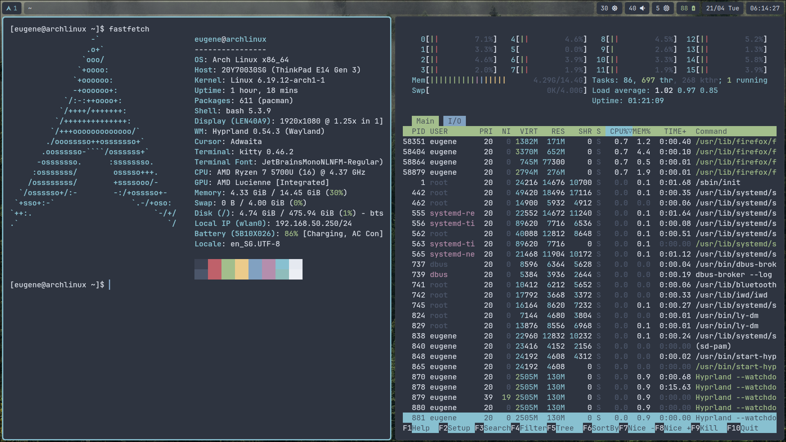
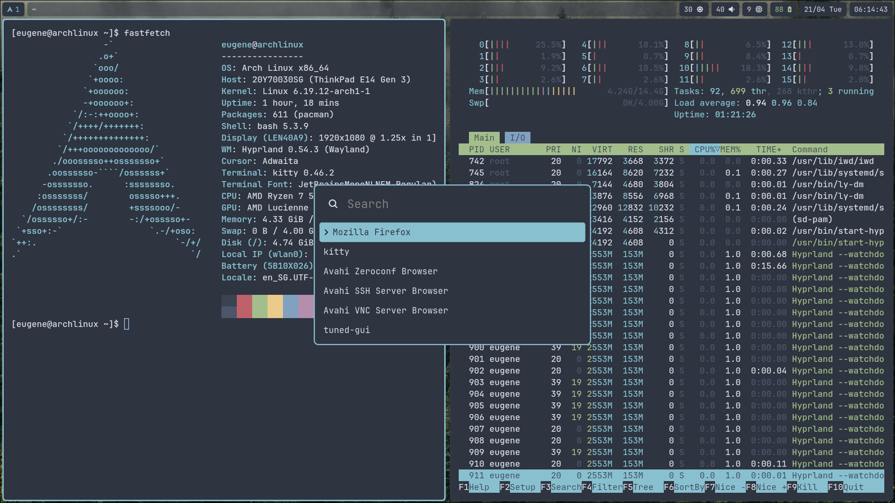
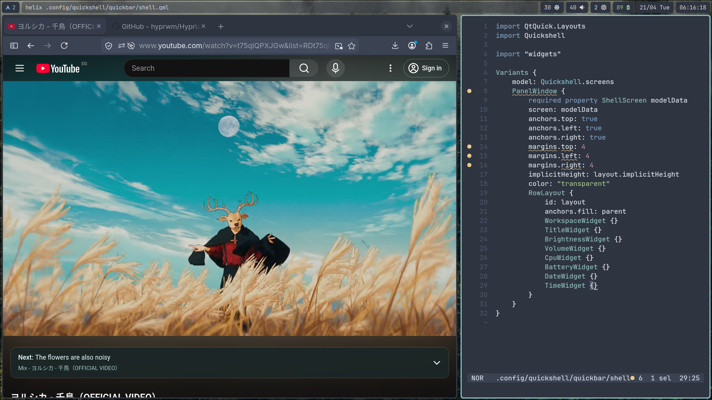

# dotfiles

Personal dotfiles for minimal Wayland setup.

    

    

    

## Applications

- **Window Manager:** [hyprland](https://hypr.land/)
- **Launcher** [wofi](https://github.com/SimplyCEO/wofi)
- **Status Bar:** [quickshell](https://quickshell.org/)
- **Terminal:** [kitty](https://sw.kovidgoyal.net/kitty/)

## Dependencies (Arch Linux)

These packages are required for the fonts and icons to render correctly in the status bar and terminal:

- `hyprland`
- `hyprpaper`
- `wofi`
- `quickshell`
- `kitty`
- `noto-fonts`
- `ttf-jetbrains-mono-nerd`

## Wallpaper

[Daniel Leone](https://unsplash.com/photos/snowy-mountain-g30P1zcOzXo)

## Color Scheme

[Nord](https://www.nordtheme.com/)

## Firefox Theme

[Nord](https://addons.mozilla.org/en-US/firefox/addon/nord123/)
